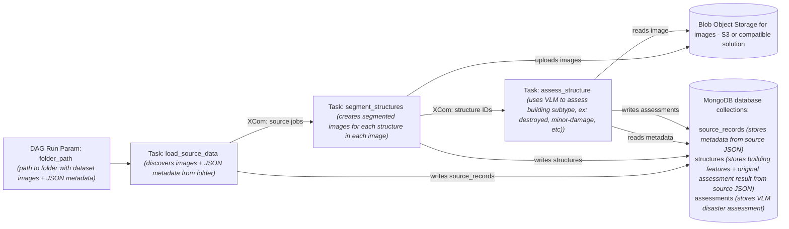

# Surge

## About
Surge is an AI-assisted web dashboard that is designed to assess post-disaster building damages in a more efficient manner. After a natural disaster, emergency responders and FEMA teams need rapid and accurate analysis of affected buildings to prioritize resources. Traditional manual assessment takes too long and is labor intensive. Surge addresses this by running a Vision Language Model (VLM) pipeline to classify building damage from paired pre and post disaster aerial images. We store the results in a cloud database and surface them through an interactive map dashboard with a chatbot.

See the [wiki](https://github.com/danhdav/Disaster-Detection-VLM/wiki) for more information on how the application works.

## Setup

1) Frontend: Follow the instructions in the [frontend README](./frontend/README.md).
2) Backend: Follow the instructions in the [backend README](./backend/README.md).

## Data Pipeline Flow

